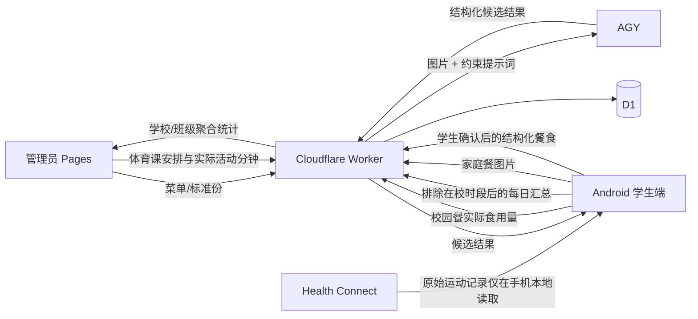

# health2609 比赛提交说明

## 一句话说明

health2609 把学校掌握的“菜单与体育课事实”和学生手机掌握的“校外运动”合并，再让学生确认自己真正吃了多少、家庭餐识别是否正确，形成一份当天可解释的饮食与活动记录。

## 核心流程

## 数据口径

校园餐由管理员提前录入菜品、标准份和可选营养数据。学生端记录实际吃了多少，支持常用份量比例和精确克数。营养总量由确定性代码按确认份量换算，不让模型直接决定最终统计值。

校内体育不从手机步数或运动记录反推。管理员维护课程安排，并记录当节课实际活动分钟。学生当天运动量由“体育课实际活动分钟 + 校外运动”组成。

校外运动只在 Android 本地读取 Health Connect。App 先拿学校配置的在校时段，本地排除这些时间段，只上传当天聚合分钟、步数和活动能量，不要求原始 GPS 轨迹。

家庭餐照片不落 R2。Worker 只做大小/类型校验并通过现有 Cloudflare Tunnel 转发给 AGY，AGY 输出经过 schema 校验后返回学生端。学生可以改食品名、份量，确认后才写入 D1。

## 管理员统计

管理员看板支持日期与班级范围筛选，展示：

- 餐食记录参与率；
- 菜品平均完成度；
- 已记录学生的平均能量与宏量营养；
- 体育课实际活动分钟与录入覆盖率；
- 当天平均总活动分钟；
- 达到学校活动目标的比例；
- 近 7 天餐食记录与运动达标趋势。

统计以聚合为主，Demo 不提供无必要的个体健康明细。

## 线上 Demo

- 管理台与 API 统一入口：`https://h2609.lunarlab.uk`
- 管理台静态文件由 CI 构建；生产 Demo 当前由同一 Worker 在根路径直接提供，`/v1/*` 保留给 API。
- 独立 Cloudflare Pages 项目 `health2609-admin` 已连接 GitHub，作为静态管理台的备用部署路径。
- 生产 D1：`health2609`，7 个 schema migration 已全部应用。
- CI 会从公网检查根页面、`/healthz`，以及通过管理员接口读取 Demo 班级，避免“面板显示已部署但实际不可用”。

## 技术组成

Android 使用 Kotlin、Jetpack Compose 与 Material 3 Expressive。轻量本地 UI 状态使用 Preferences DataStore；业务数据以 Worker 为准。Health Connect 只在端侧读取。

后台使用 Cloudflare Worker + D1。跨端 schema 位于 `packages/contracts`。管理员端是 Vite + React Pages 应用，与 Android 共用同一 Worker API。

家庭餐模型能力不单独部署新的模型服务，而是通过受约束提示词调用现有 AGY。这样模型负责“看图并提出结构化候选”，营养和活动统计仍由普通程序计算。

## 60 秒演示路径

0–8 秒：打开管理员端，展示当天午餐菜单和标准份/营养构成。

8–16 秒：切到体育课区，展示课程表与“实际活动分钟”的管理员录入。

16–28 秒：打开 Android，学生选择当天各菜实际吃了多少，展示即时营养构成并保存。

28–38 秒：点击同步手机运动，说明 Health Connect 数据会先在手机端排除在校时段，再上传校外汇总。

38–48 秒：选择一张家庭餐照片，展示 AGY 返回的结构化食品；修改一项份量后确认保存。

48–60 秒：回到管理员看板，切换全校/班级，展示餐食参与率、菜品完成度、体育课覆盖率和 7 天活动趋势。

## 演示时建议强调

不要把重点放在“AI 自动识别一切”。核心差异是数据来源有明确边界：学校提供校内事实，手机提供校外事实，学生负责确认自己真正吃了什么，模型只处理最适合模型处理的家庭餐图像理解。

## 提交前检查

- Android 可以安装并完成校园餐记录主流程；
- 管理员 Pages 可以录菜单、在校时段、体育课和实际活动分钟；
- Health Connect 无权限、不可用、无学校时段时均有可理解提示；
- 家庭餐识别失败不会直接写入营养统计；
- 管理端全校/班级统计口径一致；
- release APK 使用比赛提交用 keystore 签名；
- API URL 指向实际比赛环境，而不是 example.invalid；
- 录制演示前准备当天菜单、体育课和至少一组可见统计数据。
